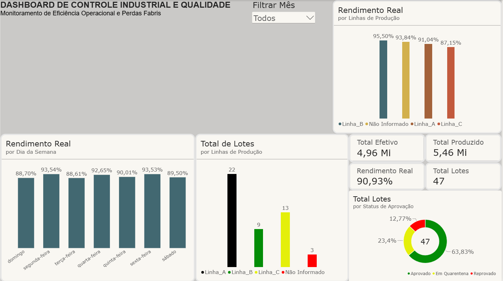

# Análise de Eficiência e Rendimento em Lotes de Produção Farmacêutica

Projeto prático focado em Engenharia e Análise Exploratória de Dados (EDA) para a indústria farmacêutica. O objetivo é higienizar dados de sensores e logs de produção, identificar gargalos de processo e preparar a base para modelagem e dashboards no Power BI.

## Contexto de Negócio
A operação farmacêutica lida com parâmetros críticos de qualidade e rendimento. A base original continha ruídos típicos de chão de fábrica: falhas de sensores, duplicatas no log, rendimentos fisicamente impossíveis e falta de padronização nas datas.

## O que foi feito no Pipeline (Python & Pandas)
- **Limpeza de Duplicatas e Nulos:** Remoção de registros repetidos e tratamento de linhas de produção não preenchidas.
- **Validação de Regras de Negócio:** Filtragem de outliers de rendimento fora da faixa real (0% a 100%).
- **Tratamento de Tipos e Sensores:** Conversão forçada de leituras corrompidas de unidades produzidas e descarte controlado de dados sem medição confiável.
- **Engenharia de Variáveis Temporais:** Padronização de datas para extração de ano, mês e dia da semana.
- **Métricas Derivadas:** Cálculo do volume efetivo real produzido (`unidades_efetivas`).
- **Análise Estatística e Correlação:** Avaliação da relação entre a temperatura do reator e o rendimento com Coeficiente de Pearson.

## Principais Insights Encontrados
- **Variação por Dia da Semana:** Identificou-se que os lotes produzidos aos domingos apresentam o menor rendimento médio da fábrica (~87,3%), contra mais de 93% no meio da semana, indicando possível impacto de troca de turno ou escalas reduzidas.
- **Temperatura vs. Rendimento:** A correlação calculada ficou próxima de zero (~0.07), indicando que a oscilação de temperatura observada nos reatores não é o fator linear causador da perda de rendimento.

# 🏭 Dashboard de Controle de Produção e Qualidade Industrial (Power BI & DAX)

Este projeto consiste em um dashboard executivo desenvolvido no Power BI voltado ao monitoramento operacional, eficiência de linhas fabris e controle de qualidade em ambiente industrial.

O projeto foi construído sobre uma arquitetura em **Star Schema (Esquema Estrela)**, conectando dados brutos de chão de fábrica tratados via Python/Pandas a um modelo analítico robusto com medidas DAX customizadas.

---

## 📸 Visão Geral do Dashboard


---

## 🎯 Dores de Negócio Solucionadas

Em indústrias de manufatura e processos contínuos, a tomada de decisão muitas vezes sofre com:
- Dificuldade em rastrear a causa-raiz de quedas de rendimento entre turnos e dias da semana.
- Falta de visibilidade em tempo real sobre lotes travados em quarentena vs. descarte por reprovação.
- Ausência de métricas ponderadas, que distorcem o rendimento real dos lotes produzidos.

O painel centraliza esses indicadores em uma interface executiva intuitiva e interativa.

---

## 🛠️ Modelagem de Dados & Arquitetura (Star Schema)

A modelagem segue as melhores práticas de Business Intelligence:
- **`fProducao` (Tabela Fato):** Registros granulares de ordens de produção, linha fabril, volume planejado, volume efetivo, temperatura de processo e status de aprovação.
- **`dCalendario` (Tabela Dimensão):** Gerada via DAX (`CALENDAR`), permitindo análises contínuas de inteligência temporal com ordenação cronológica rigorosa de meses e dias da semana.
- **`_Medidas`:** Tabela dedicada isolando a camada semântica e regras de cálculo.
- **Relacionamento:** 1 para Muitos (1:*) com filtro unidirecional (`dCalendario[Data]` -> `fProducao[data_producao]`), assegurando performance e integridade referencial.

---

## 📐 Métricas Principais em DAX

```dax
// 1. Total Produzido (Volume total planejado/iniciado)
Total Produzido = SUM(fProducao[quantidade_produzida])

// 2. Total Efetivo (Volume real aproveitado após perdas)
Total Efetivo = SUM(fProducao[quantidade_efetiva])

// 3. Rendimento Real Ponderado (Evita a falácia da média das médias)
Rendimento Real = 
DIVIDE(
    [Total Efetivo],
    [Total Produzido],
    0
)

// 4. Total de Lotes Auditados (Contagem única consistente)
Total Lotes = DISTINCTCOUNT(fProducao[id_lote])